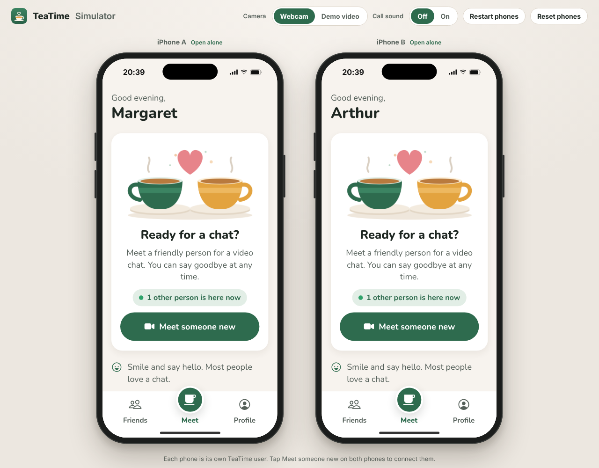
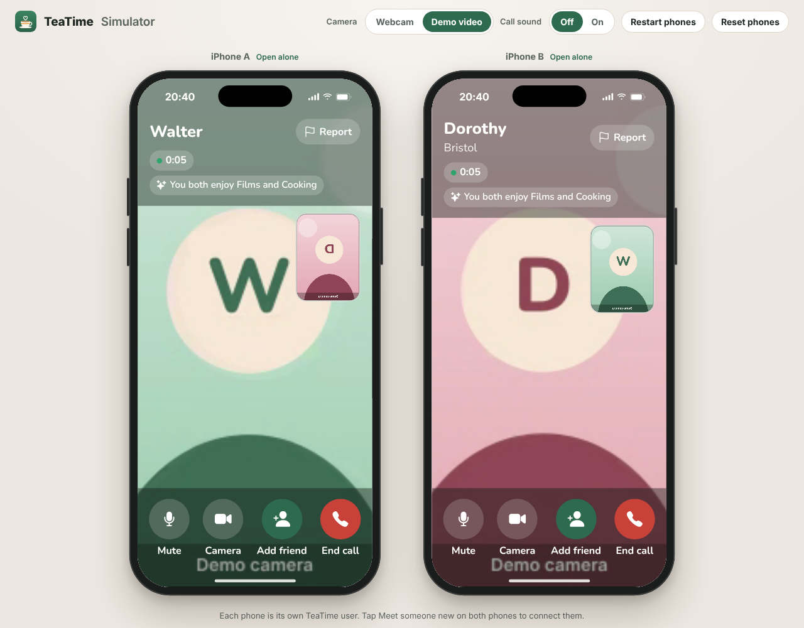
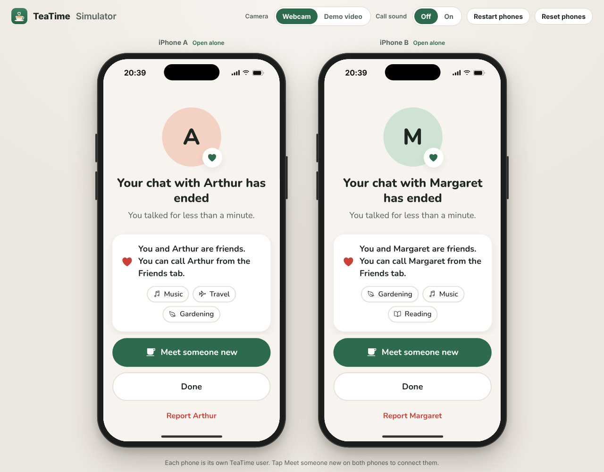
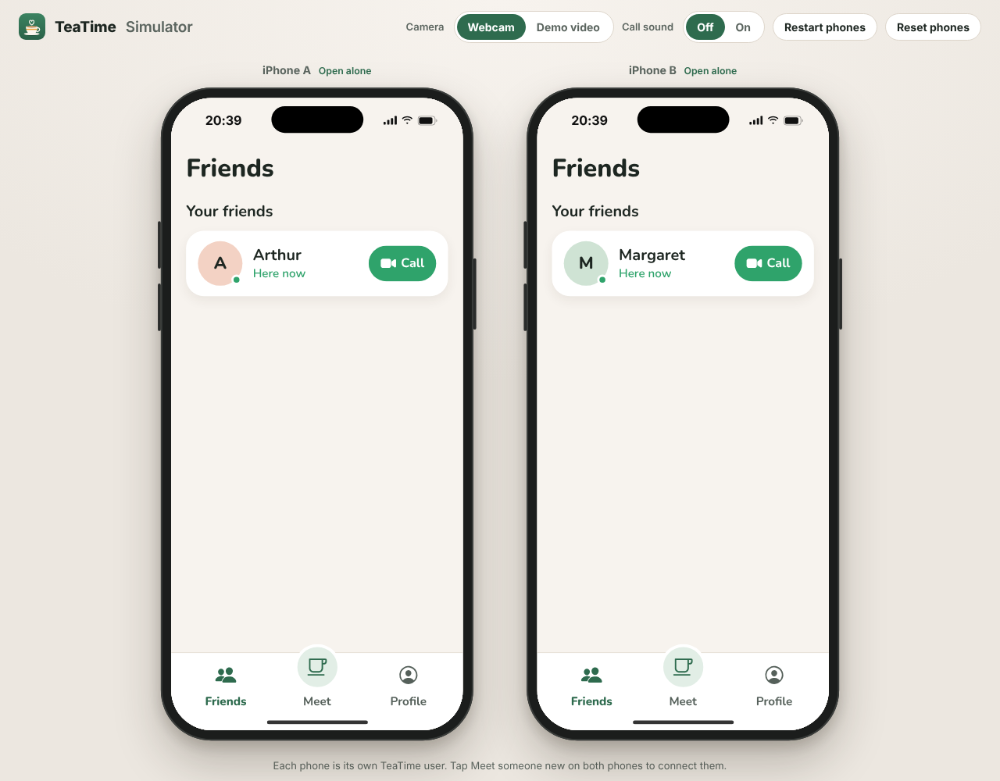
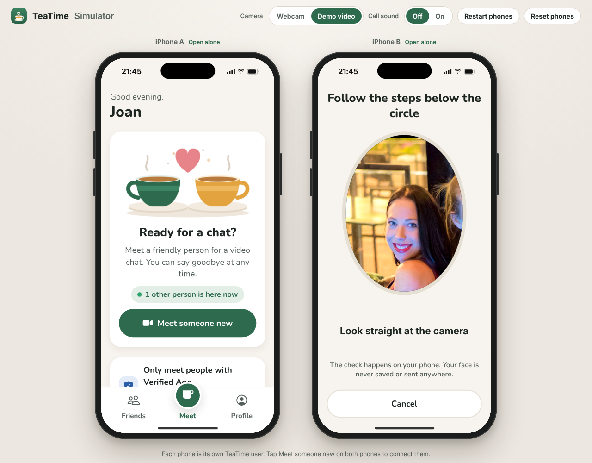
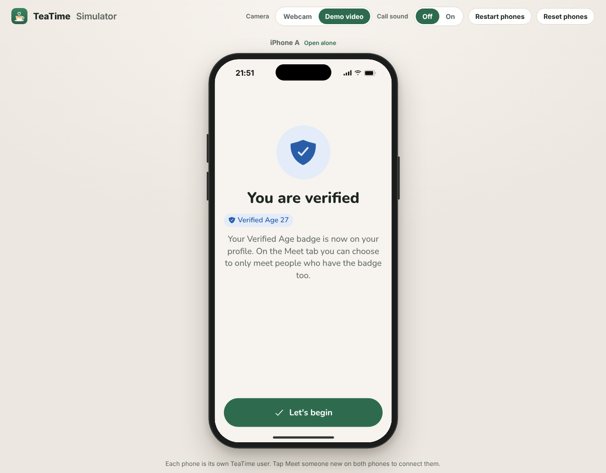
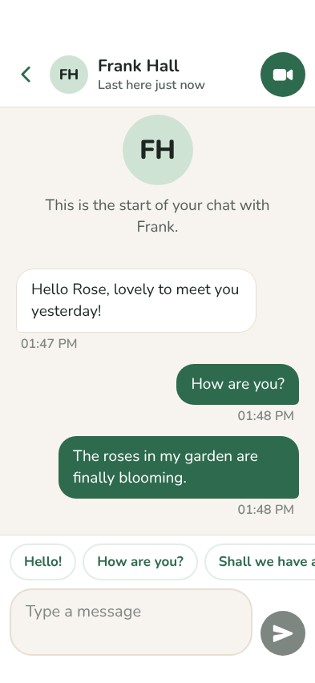
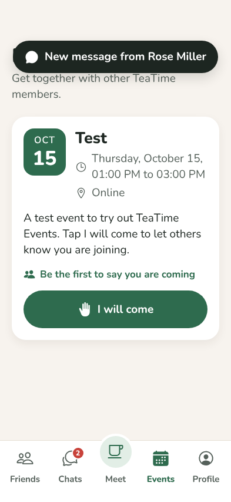

# TeaTime

Friendly video chats for older people.

TeaTime pairs you with someone new for a face to face chat. If you enjoy talking, tap Add friend, and you can call each other again whenever you both have the app open. Everything is built around big text, big buttons and simple words.

<p align="center">
  
</p>

The app has three tabs:

| Friends | Meet | Profile |
| --- | --- | --- |
| Friend requests, your friends with a green dot when they are here, a Call button for each, and the people you met recently | One big button: Meet someone new. You see how many people are here and which friends are online | Your photo, name, place, about me, interests, text size, help and safety, blocked people, delete account |

During a call there are four large buttons with labels: Mute, Camera, Add friend and End call. A Report button sits at the top.

### Features

* **Verified Age badge.** Type the year you were born, look at the camera and slowly turn your head to each side. A face model on the phone estimates your age, and if it matches you get the badge. No ID, nothing to pay, and your face is never saved or sent anywhere. Photos do not work because a photo cannot turn its head. Anyone can skip it.
* **Age confirm.** If the age you typed does not match, TeaTime shows the age it sees and asks "Is that right?". Tap Yes, or tap No and type your age to check once more.
* **Chats.** Send messages to your friends from the new Chats tab. Big bubbles, big text and one tap replies like "How are you?". Unread messages show a number on the tab.
* **Call friends who are not in the app.** TeaTime rings their phone for a minute. If they open TeaTime in time, the call comes straight in. If not, they see "Missed call from Rose" in the chat with a Call back button.
* **Notifications.** New messages and calls show up as phone notifications. Tapping one opens the right chat.
* **Events.** The Events tab lists get togethers for TeaTime members. Tap "I will come" to see who else is coming and get a reminder the day before and an hour before.
* **Voice messages.** Tap the microphone in a chat, talk, and tap Send. No typing needed.
* **Read aloud.** Every message from a friend has a Read aloud button.
* **Scam warning.** When a message mentions money, bank details or gift cards, a "Be careful" note shows under it with a button to report it.
* **Plan a call.** Pick a day and a time in a chat. Both phones get a reminder 15 minutes before and when it is time.
* **Daily tea time reminder.** Turn it on in Profile and pick a time for a friendly nudge each day.
* **Report and block in chats.** Tap the three dots at the top of a chat.
* **Only meet verified people.** People with the badge can switch on "Only meet people with Verified Age" on the Meet tab.
* **Same language matching.** You pick the languages you speak, and TeaTime only matches people who share one.
* **Something to talk about.** During a call, tap Topic idea and both of you see the same friendly question, such as "What was your very first job?"
* **Reactions.** Send a wave, a heart, a laugh or applause with one tap. It floats up big on the other screen.
* **See who you are talking to.** Tap the person's name during a call, or after the call, to see their profile.
* **Notes about friends.** Write private notes on a friend's page, like "grandson Tom, loves roses", so you remember next time.
* **Call history.** Each friend's page shows how often you have talked and when you last chatted.
* **Safety.** Report and block from every call, community rules on sign up, profile text checks against scams, and automatic removal of people who get reported.

| Meet | In a call |
| --- | --- |
|  |  |
| **After a call** | **Friends** |
|  |  |
| **Age check** | **Verified Age** |
|  |  |
| **Chats** | **Events** |
|  |  |

## What is in this repository

| Folder | What it is |
| --- | --- |
| `app/` | The iPhone app, built with Expo (React Native) and WebRTC for video |
| `server/` | The TeaTime server: accounts, matching, friends, call signaling, moderation and the age check page. Runs on Cloudflare, Docker or plain Node.js |
| `simulator/` | Two simulated iPhones in your browser, each running the real app |
| `.github/workflows/ios.yml` | Builds `TeaTime.ipa` on a GitHub Mac and publishes it as a release |
| `.github/workflows/android.yml` | Builds `TeaTime.apk` for Android phones and publishes it as a release |
| `.github/workflows/ci.yml` | Runs the server tests, the app type check, the web build and a Docker smoke test |

## Try it in the simulator

You need [Node.js](https://nodejs.org) 22.13 or newer. Then, from the repository folder:

```bash
npm run simulator
```

The first run installs packages and builds the app, which takes a few minutes. Your browser then opens `http://localhost:8080/simulator` with **iPhone A** and **iPhone B** side by side. Each phone is its own TeaTime user.

1. Go through the welcome steps on both phones.
2. Tap **Meet someone new** on both phones. They find each other and the video call starts.
3. Tap **Add friend** on one phone and **Accept friend** on the other.
4. Tap **End call**, open the **Friends** tab and tap **Call**. The other phone rings.

The toolbar at the top has:

* **Camera**: use your webcam, or a demo video if you have no webcam or want each phone to look different.
* **Call sound**: off by default. Both phones share your computer's speakers and microphone, so sound on both causes echo. Turn it on with headphones.
* **Restart phones** reloads both apps. **Reset phones** starts both from the welcome screen as new people.

Options: `npm run simulator -- --port 9000`, `--phones 3` for three phones, `--no-open` to skip opening the browser, `--rebuild` to force a fresh build.

## Install it on your iPhone

The latest build is always on the [ios-latest release](https://github.com/hugo245/teatime/releases/tag/ios-latest) as `TeaTime.ipa`. A new one is built every time the app code changes.

Apple only runs apps that are signed with an Apple ID, so the file needs to be signed once on your computer. The simplest free tool is Sideloadly:

1. Install [Sideloadly](https://sideloadly.io) on your Mac or Windows PC.
2. Connect your iPhone with a cable and tap **Trust** on the phone.
3. Drag `TeaTime.ipa` into Sideloadly, type your Apple ID and press **Start**.
4. On the iPhone open **Settings, General, VPN and Device Management**, tap your Apple ID and tap **Trust**.
5. On iOS 16 and newer, also turn on **Settings, Privacy and Security, Developer Mode** and restart the phone.

With a free Apple ID the app keeps working for 7 days, after which you sign it again the same way. With a paid Apple Developer account it lasts a year and you can use TestFlight. [AltStore](https://altstore.io) works too.

## Install it on Android (Samsung and others)

The latest Android build is on the [android-latest release](https://github.com/hugo245/teatime/releases/tag/android-latest) as `TeaTime.apk`. It uses the same server, so Android and iPhone users meet and call each other.

1. Open that page on the Android phone and tap `TeaTime.apk` to download it.
2. Open the downloaded file. If the phone asks, allow installing apps from your browser or My Files.
3. Tap **Install**, then **Open**.

## Updates without sending the app again

Install the app once. After that, people get new versions from inside the app:

1. Every time the app code changes on GitHub, the **App update** workflow publishes the new version on the [ota-latest release](https://github.com/hugo245/teatime/releases/tag/ota-latest).
2. When TeaTime opens, it asks the server if there is something new. If there is, the **Meet** and **Profile** screens show a card with an **Update App** button.
3. Tapping **Update App** downloads the new version and restarts TeaTime with it. This works on iPhone and Android.

Bigger changes that touch the phone side of the app (a new camera or sound library, for example) cannot be sent this way. For those, raise `runtimeVersion` in `app/app.config.ts`. Then:

- **Android** shows the same **Update App** button. It downloads the new `TeaTime.apk` and opens the Android installer, where you tap **Install**. The first time, Android asks to allow TeaTime to install apps.
- **iPhone** shows the same card with an **Update App** button. Apple does not let an app install a new version of itself, so the button hands the new `TeaTime.ipa` to [SideStore](https://sidestore.io), a free app that installs and refreshes sideloaded apps right on the iPhone. SideStore opens, installs the update and TeaTime is up to date. On the App Store or TestFlight this happens automatically.

### One tap iPhone updates with SideStore

1. Set up SideStore once by following the guide on [sidestore.io](https://sidestore.io). It needs a computer one time. After that it works on the iPhone alone and also renews the 7 day free signing for you.
2. Install TeaTime through SideStore instead of Sideloadly: in SideStore open **My Apps**, tap **+** and pick `TeaTime.ipa`. If TeaTime was installed with Sideloadly before, delete that copy first so there is only one. You may need to set up your profile again after switching.
3. From then on, when a bigger update comes out, TeaTime shows **Update App**. Tap it, SideStore installs the new version, done.

Without SideStore the button explains that the update has to be installed with Sideloadly again.

Phones only get updates made for their own `runtimeVersion`, so an update never breaks an older install.

### Very old iPhone builds

iPhone builds from before the update button (12 and older) cannot show an update card. The server recognises them and asks them to update instead: they get signed out, and when they try to sign up again they see "This version of TeaTime is too old. Please install the newest TeaTime with Sideloadly". Their profile and friends stay on the server, and the new app signs them back in by itself. To change which builds count as too old, run `npx wrangler secret put MIN_IOS_BUILD` in the `server` folder and type a build number.

## Notifications when TeaTime is closed

While TeaTime is open or was used a moment ago, messages and calls show up as notifications on both iPhone and Android with no setup.

To also wake **Android** phones when TeaTime is fully closed, connect a free Firebase project once:

1. Go to [console.firebase.google.com](https://console.firebase.google.com), sign in with a Google account and click **Create a project**. Analytics is not needed.
2. Click **Add app**, choose **Android** and type `com.hugo245.teatime` as the package name. Download `google-services.json`.
3. On GitHub open **Settings, Secrets and variables, Actions, Secrets**, click **New repository secret**, name it `GOOGLE_SERVICES_JSON` and paste the whole contents of that file. Run the **Android build** workflow again.
4. In Firebase open **Project settings, Service accounts** and click **Generate new private key**. In Terminal, in the `server` folder, run `npx wrangler secret put FIREBASE_SERVICE_ACCOUNT` and paste the whole contents of that key file.

Android phones with the new app now ring when a friend calls, even when TeaTime is closed.

On **iPhone**, notifications while the app is closed need Apple's push service, which requires a paid Apple Developer account. With Sideloadly and a free Apple ID, iPhone users see calls and messages when they open TeaTime, and missed calls wait in their chats.

## Events

TeaTime starts with one event called **Test**. Add more with your `ADMIN_TOKEN`:

```bash
curl -X POST -H "Authorization: Bearer $ADMIN_TOKEN" -H "Content-Type: application/json" \
  -d '{"title":"Coffee morning","description":"Meet other members for coffee and cake.","location":"Central Library, room 2","startsAt":"2026-11-14T10:00:00Z","endsAt":"2026-11-14T12:00:00Z"}' \
  https://your-server/admin/events
curl -X DELETE -H "Authorization: Bearer $ADMIN_TOKEN" https://your-server/admin/events/EVENT_ID
```

Events disappear by themselves a day after they end.

### Connect the iPhone to a server

The app talks to a TeaTime server to find people and set up calls.

**Quick test on your home Wi-Fi.** Run `npm run simulator` on your computer. The terminal prints an address such as `http://192.168.1.20:8080`. Open TeaTime on the iPhone, tap **Get started** and type that address. Allow **Local Network** when the iPhone asks. Your real iPhone can now meet and call the simulated phones.

**Real use.** Put the server online (see below). Then set it as the default in `app/app.config.ts`, or on GitHub open **Settings, Secrets and variables, Actions, Variables** and add a variable named `TEATIME_SERVER_URL` with your server address, for example `https://teatime.example.com`. Run the **iOS build** workflow again from the Actions tab. The new `TeaTime.ipa` connects to your server by itself.

To change the server inside the app later, open **Profile** and hold your finger on the version number for two seconds.

## Put TeaTime online for free

TeaTime runs on Cloudflare's free plan, so everybody's app connects to one global server. No credit card is needed, it stays online all the time, and profiles and friends are saved for good.

1. Make a free account at [dash.cloudflare.com/sign-up](https://dash.cloudflare.com/sign-up).
2. In Terminal, in the teatime folder:
   ```bash
   git pull
   cd server
   npm install
   npx wrangler login
   npx wrangler deploy
   ```
   `wrangler login` opens your browser to approve. The first deploy asks you to pick a name for your `workers.dev` address.
3. The last line shows your server address, for example `https://teatime.yourname.workers.dev`. Open it with `/health` at the end to check it works.
4. Put that address in the app. On GitHub open **Settings, Secrets and variables, Actions, Variables**, add `TEATIME_SERVER_URL` with your address, then run the **iOS build** workflow again from the Actions tab. The new `TeaTime.ipa` connects to your server by itself, so nobody has to type an address.

To update the server later, run `npx wrangler deploy` again in the `server` folder. To set a password for the moderation tools, run `npx wrangler secret put ADMIN_TOKEN`.

The free plan comfortably covers a school project or a small community. Very busy days can reach the daily free limit, after which Cloudflare pauses the server until the next day.

## Run the server yourself

The same server also runs as a normal Node.js program with a SQLite database, for example on your own computer or with Docker. It needs HTTPS in front of it when phones connect over the internet.

**With Docker**

```bash
docker build -t teatime-server server
docker run -p 8080:8080 -v teatime-data:/data \
  -e ADMIN_TOKEN=a-long-random-secret \
  -e SUPPORT_EMAIL=you@example.com \
  teatime-server
```

**With Render**: create a new Blueprint and choose this repository. `render.yaml` sets up the server with a disk for the database.

**Without Docker**: `cd server && npm ci && npm run build && npm start`.

### Settings

| Variable | Meaning |
| --- | --- |
| `PORT` | Port to listen on, default `8080` |
| `DATABASE_FILE` | Where the SQLite database lives, default `data/teatime.db` |
| `SUPPORT_EMAIL` | Shown in the app under Help and on the privacy page |
| `ADMIN_TOKEN` | Password for the moderation endpoints |
| `TRUST_PROXY` | Set to `1` behind a proxy or load balancer so rate limits see real addresses |
| `TURN_URLS`, `TURN_USERNAME`, `TURN_CREDENTIAL` | Your TURN relay, see below |
| `ICE_SERVERS` | Full WebRTC ICE server list as JSON, if you prefer to set it directly |
| `FIREBASE_SERVICE_ACCOUNT` | Firebase service account key as JSON, for Android notifications when the app is closed |
| `AGE_TEST_SKIP` | Set to `0` to turn off the hidden testing shortcut in the age check |
| `DISCORD_WEBHOOK_URL` | Discord webhook link for reports |
| `TURN_KEY_ID`, `TURN_KEY_API_TOKEN` | Cloudflare TURN key, so calls work on mobile data too |
| `MIN_IOS_BUILD` | iPhone builds older than this are asked to install the newest TeaTime. Default `13` |
| `UPDATES_URL` | Where app updates are downloaded from, default `https://github.com/hugo245/teatime/releases/download` |

### TURN relay for mobile networks

Video goes straight from one phone to the other. On mobile data and some home routers a direct path is impossible and the call needs a relay, called a TURN server. Without one, some calls stay stuck on "Connecting".

The easiest option is Cloudflare's own TURN service, which has a free allowance of 1,000 GB a month:

1. In the Cloudflare dashboard open **Realtime**, then **TURN Server**, and click **Create**.
2. Copy the **Turn Token ID** and the **API Token**.
3. In the `server` folder run these two commands and paste each value when asked:
   ```bash
   npx wrangler secret put TURN_KEY_ID
   npx wrangler secret put TURN_KEY_API_TOKEN
   ```

The server then creates fresh relay passwords every day and gives them to the app before each call. Other providers such as Metered, Twilio or your own [coturn](https://github.com/coturn/coturn) work too through the three `TURN_URLS`, `TURN_USERNAME` and `TURN_CREDENTIAL` settings.

## Safety and moderation

* **Verified Age** uses a live camera check with head turns, so a photo of someone else does not pass. Face age estimates are never exact, so the check allows a margin, and a wider one for older faces.
* **Testing shortcut.** Tapping the title "Get your Verified Age badge" five times shows a button that skips the camera and still gives the badge. It is there for testing the app. Before real people use TeaTime, turn it off with `npx wrangler secret put AGE_TEST_SKIP` and the value `0`, or set `AGE_TEST_SKIP=0` on your own server.
* **Messages** can only be sent between friends, with a limit of 20 messages a minute.
* **Report** is always one tap away during a call. It ends the call, blocks that person and stores the report.
* **Block** from a friend's page. Blocked people can never be matched with you or call you.
* When three different people report someone within a week, that account is removed automatically and that phone cannot sign up again.
* Profile text is checked for rude words, links, email addresses and phone numbers, which protects against scammers.
* Friend requests are only possible between people who have actually talked.
* Calls are never recorded. Video and sound are encrypted and travel directly between the phones whenever possible.

### Reports in Discord

Every report is posted to a Discord channel with who reported who, the reason and the last messages between them. Under each report are buttons:

* **Send a warning.** The person sees a message from the TeaTime team in their app the next time they open it.
* **Remove account.** The person is signed out for good and their phone cannot sign up again. They see a message that their account was removed.
* **No action.** Nothing happens to the person. They stay blocked for the one who reported them.

Each button opens a page on your server where you confirm the choice, so nothing happens by accident. The person who reported always gets a short update in their app, for example "We looked at your report about Tom and sent them a warning."

To turn it on, make a webhook in Discord (**Server Settings, Integrations, Webhooks, New Webhook**, pick the channel, **Copy Webhook URL**). Then in the `server` folder run:

```bash
npx wrangler secret put DISCORD_WEBHOOK_URL
```

and paste the link. Keep that link private. Anyone who has it can post in your channel.

Moderation endpoints, using your `ADMIN_TOKEN`:

```bash
curl -H "Authorization: Bearer $ADMIN_TOKEN" https://your-server/admin/reports
curl -X POST -H "Authorization: Bearer $ADMIN_TOKEN" https://your-server/admin/reports/12/resolve
curl -X POST -H "Authorization: Bearer $ADMIN_TOKEN" https://your-server/admin/users/USER_ID/ban
curl -X POST -H "Authorization: Bearer $ADMIN_TOKEN" https://your-server/admin/users/USER_ID/unban
```

The server also serves the privacy policy at `/privacy` and the community rules at `/terms`.

## Publishing on the App Store

1. Join the Apple Developer Program.
2. Pick your bundle identifier and set it as the `TEATIME_BUNDLE_ID` Actions variable. The default is `com.hugo245.teatime`.
3. Build a signed version. The easiest route is `cd app && npx eas-cli build --platform ios`, which handles certificates for you. You can also run `npx expo prebuild --platform ios` and archive the `ios` folder in Xcode.
4. In App Store Connect, use `https://your-server/privacy` as the privacy policy address and give a support address.
5. In the review notes, mention that people agree to community rules on sign up, can report and block from every call, and that reported accounts are removed. Apple requires this for apps where strangers meet.
6. Answer the age rating questions honestly. Apps that connect strangers on video usually get the highest age rating, which is normal for this kind of app.

## Design choices for older people

* Body text is 19 points and headings go up to 34 points. Profile has three text sizes, and the app also follows the iPhone's own text size.
* Every button is at least 44 points tall, main buttons are 64 points, and every icon has a word under it.
* One question per screen while signing up, with a clear Back button and a progress bar.
* Calls use the loudspeaker by default and the screen stays on during a call.
* Gentle ringtone and vibration for incoming calls.
* Calm colours with strong contrast, and no hidden gestures for anything important.

## Good to know

* A friend can only be called while their TeaTime app is open. Ringing a locked phone needs Apple push notifications with CallKit, which requires a paid developer account and push certificates.
* The Android app is built from the same code. It has been built automatically but not yet tested on a real Android phone.

## Development

```bash
cd server && npm test                 # server tests
cd app && npx tsc --noEmit            # app type check
npm run server                        # server on http://localhost:8080
cd app && EXPO_PUBLIC_SERVER_URL=http://localhost:8080 npx expo start --web
```

Project layout inside `app/src`:

| Path | What it does |
| --- | --- |
| `app/` | Screens, using Expo Router. `(tabs)` holds Friends, Meet and Profile |
| `call/` | The call engine, the full screen call views, the ringtone and the report sheet |
| `rtc/` | Video: `index.tsx` for the iPhone, `index.web.tsx` for the simulator |
| `state/` | Session, friends, settings and onboarding stores |
| `lib/` | Server API, realtime connection, storage, photos and helpers |
| `components/` | Buttons, text, avatars, cards, sheets and the tab bar |

`app/modules/call-audio` is a small native iOS module that routes call sound to the loudspeaker.
